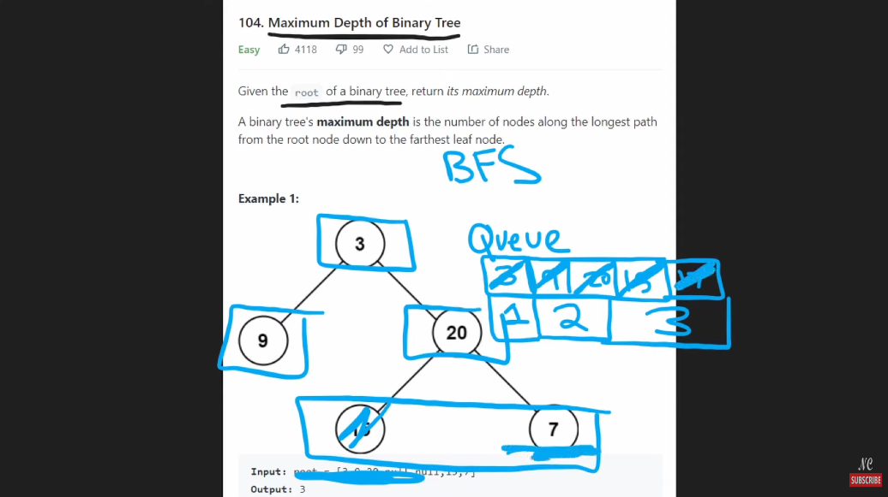

# 104. Maximum Depth of a binary tree

Tree struct
```python
class TreeNode:
    def __init__(self, val=0, left=None, right=None):
        self.val = val
        self.left = left
        self.right = right
```
## Recursive DFS solution
```python
class Solution:
    def maxDepth(self, root: Optional[TreeNode]) -> int:
        if not root:
            return 0
        return 1 + max(self.maxDepth(root.left), self.maxDepth(root.rigth))
```
## BFS solution

```python
class Solution:
    def maxDepth(self, root: Optional[TreeNode]) -> int:
        if not root:
            return 0
        level = 0

        q = collections.deque([root])
        while q:
            for i in range(len(q)):
                node = q.popleft()
                if node.left:
                    q.append(node.left)
                if node.right:
                    q.append(node.right)
            level += 1
        return level
```

## DFS iterative with stack


```python
class Solution:
    def maxDepth(self, root: Optional[TreeNode]) -> int:
        stk = [[root, 1]] # stack of [node, depth]
        res = 0
        while stk:
            node, depth = stk.pop()
            if node:
                res = max(res, depth)
                stk.append([node.left, depth + 1])
                stk.append([node.right, depth + 1])
        return res
```

