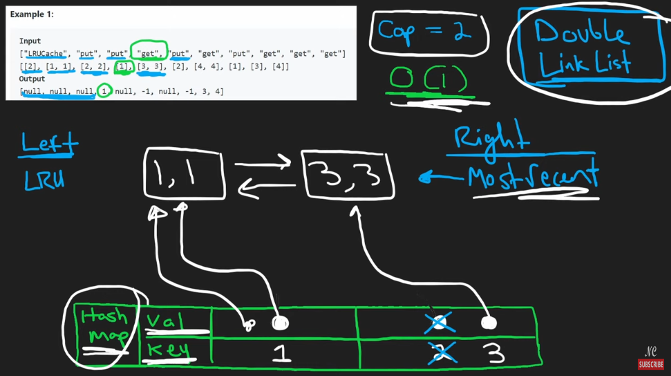

# 146. LRU Cache

## Notes


```python
class Node:
    def __init__(self, key, val) -> None:
        self.val = val
        self.key = key
        self.prev = self.next = None

class LRUCache:

    def __init__(self, capacity: int):
        self.cap = capacity
        self.left, self.right = Node(0,0), Node(0,0)
        self.left.next, self.right.prev = self.right, self.left
        self.cache = {} # key is given key and value is a node
    
    def insert(self, node):
        prev, nxt = self.right.prev, self.right
        prev.next = nxt.prev = node
        node.next, node.prev = nxt, prev
    
    def remove(self, node):
        prev, nxt = node.prev, node.next
        prev.next, nxt.prev = nxt, prev

    def get(self, key: int) -> int:
        if key in self.cache:
            self.remove(self.cache[key])
            self.insert(self.cache[key])
            # TODO because we visited the cache we have to update the LRU value
            return self.cache[key].val
        
        return -1
    
    def put(self, key: int, value: int) -> None:
        if key in self.cache:
            self.remove(self.cache[key])
        self.cache[key] = Node(key, value)
        self.insert(self.cache[key])
        if len(self.cache) > self.cap:
            lru = self.left.next
            self.remove(lru)
            del self.cache[lru.key]
```