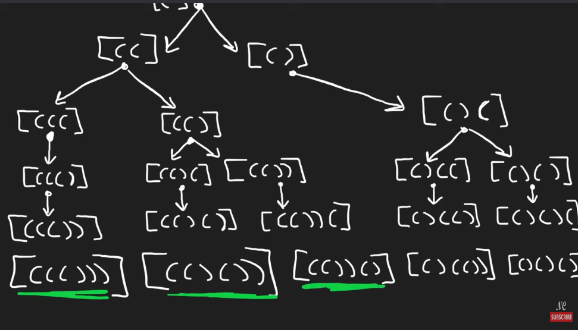

# 22. Generate parantheses

## Notes
This is a recursive backtracking problem
Base case open_paranthese = close_paranthese = n
if open_parantheses < N then add open => increment open count
if close_parantheses < open_parantheses then add close => increment close count



```python
class Solution:
    def generateParenthesis(self, n: int) -> List[str]:
        stk = []
        res = []
        def backtrack(openN, closeN):
            if openN == closeN == n:
                res.append("".join(stk))
                return
            
            if openN < N:
                stk.append("(")
                backtrack(openN + 1, closeN)
                stk.pop()
            
            if closeN < openN:
                stk.append(")")
                backtrack(openN, closeN + 1)
                stk.pop()
            
        backtrack(0,0)
        return res
```