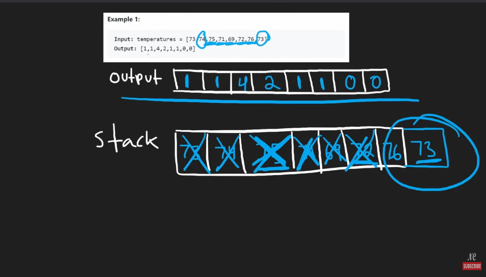

# 739. Daily Temperature

## Notes
Use a monotincally decreasing stack here when the temprature is greater than the top then for that temprature value calculate the days

store temprature and index both in the stack



```python
class Solution:
    def dailyTemperatures(self, temperatures: List[int]) -> List[int]:

        res = [0] * len(temperatures)
        stk = []
        for i,t in enumerate(temperatures):
            while stk and t > stk[-1][0]:
                stkT, stkI = stk.pop()
                res[stkI] = (i - stkI)
            stk.append([t,i])
        return res
```