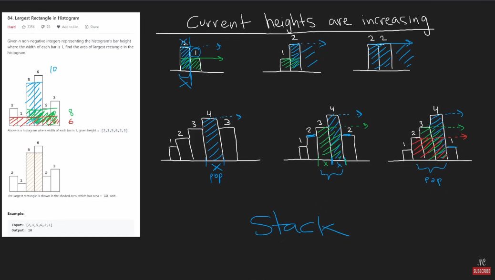
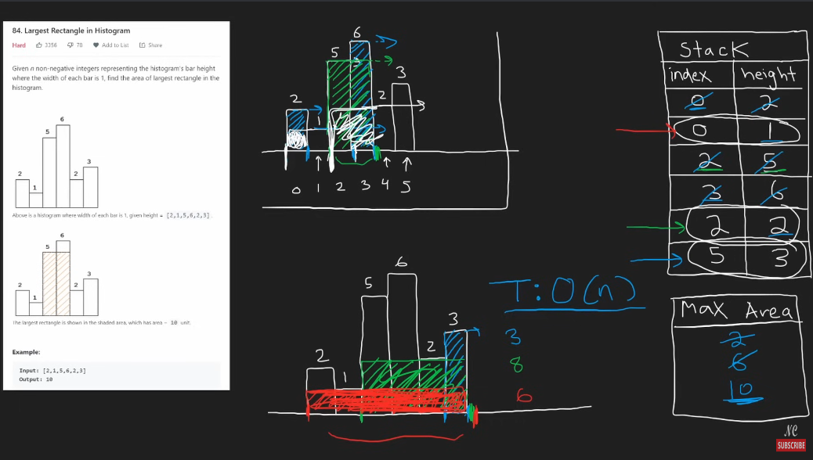

# 84. Largest rectangle in histogram

## Notes



```python
class Solution:
    def largestRectangleArea(self, heights: List[int]) -> int:
        stk = [] # stores (index, height)
        maxArea = 0
        for i, h in enumerate(heights):
            start = i
            while stk and h < stk[-1][1]:
                index, height = stk.pop()
                maxArea = max(maxArea, (i - index)*height)
                start = index
            stk.append((start, h))

        for i,h in stk:
            maxArea = max(maxArea, (len(heights)- i)*h)
        return maxArea
```